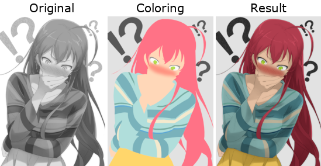

# manga-colorizer

Add color to grayscale images by making a flat color image which will be mixed with the original image.

Krita has a tool for adding colors and there is a online app [TODO find link] by drawing lines and automatically fill regions with colors. However both of them does not allow you to easily change the colors afterwards. If you want to tweak the skin color or you want to change the color palate of  the clothes, you need to redo it all again.

This is an alternative approach using color definitions in SVG files which lets you change all regions using that color by updating the definition. It is slightly more tedious, but it is more consistent and precise.



## Usage

A GUI is planned, but for now it works with JSON files. Everything is still very rough and WIP.

```JS
{
    "base": "original.jpg",
    "svg" : "coloring.svg",
    "gamma": 0.8,
    "satboost": 0.5,

    "overrides" : [
        {
            "id":"Text",
            "valsub":0.9
        },
        {
            "id":"Hair",
            "color": "#b91c1c"
        }
    ]
}
```
The image paths is supplied with `base` and `svg`. Currently the color image can only be a SVG file.

Color blending options can be specified both globally and for a specific color definition in `overrides`. They are currently:

- `gamma` which changes the gamma in the original image to brighten/darken areas.
- `satboost` which increases saturation for darker areas
- `valsub`  which decreases the value of the color in HSV. Currently needed to affect the luminance for areas with 0 saturation.

The color transfer is WIP, but currently works in HSV and uses the hue and saturation from the color  image and value from the original.
